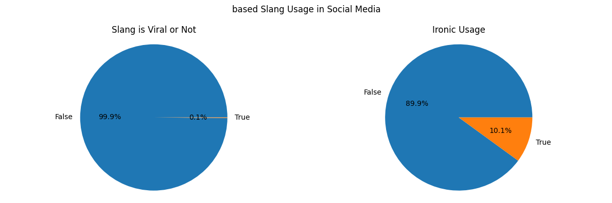

# Gen Z Slang EDA
## Introduction
In here, [Gen Z Slang Dataset](https://www.kaggle.com/datasets/likithagedipudi/genz-slang-evolution-tracker-2020-2025) will be analyzed using Python. This dataset is consist of 530000+ slang terms synthetic records from 2020 to 2025 in any social media platforms.

This dataset is unique because consist of:
1. Lifecycle Modeling: Each term has realistic phase of slang terms, emergence → growth → peak → decline → legacy
2. Multiple Platform Tracking: Usage across different popular social media, such as TikTok, Twitter, Instagram, Reddit, YouTube, Twitch, and Discord
3. Sentiment Analysis: Positive/negative/neutral sentiment with numeric scores
4. Geographic Spread: 22 platform user's regions, including United States and some international locations
5. Engagement Metrics: Likes, shares, comments, and virality scores
6. Demographic Data: Age group distributions (13-17 through 41+)

## Exploratory Data Analysis
### 1. Virality and Ironic Usage of Slang Term
Below is visualization of "based" slang term virality and its ironic usage.

#### Insights
- Only about 0.1% of social media users go viral after commenting with “based” slang. Whether a comment becomes viral depends on factors like context, timing, originality, humor, and more.
- About 10% of users use “based” as an ironic comment. Context, of something they commented, are one of many reasons for users to use that term ironically (satire, sarcasm, or just joking)

### 2. Slang Terms Category
Various slang terms are used by platform users for various categorical purpose. The following visualization shows the distribution of slang term categories.
.png)
#### Insights
- Approval, insult, identity are the most used slang terms category by users, suggesting that most people used slang as their social tools to interact.
- Many users used slang terms for humor and jokes as a way to entertain others.
- Some users also used slang terms related to reactions and emotions to express feelings and respond during social media interactions.

### 3. The Most Used Slang Words
Below is the most used slang words by social media users in United States.
.png)
#### Insights
- Slay, based, and bussin are the most popular slang term, indicating that most users use slang terms as their way to express their admiration or approval
- Terms like rizz, sigma, and delulu also popular slang term, highlighting how users comment slang to signal personal traits, online persona, or characteristic. This is also related to humor.
- This visualization shows that popular slang terms are mostly driven by giving expression, sosial comentary, humor, and identity/persona signaling, rather than niche/situational usage.

### 4. Distribution of Popular Slang Commented in Various Social Media by Gen Z of United States
Below is Distribution of Top 5 Popular Slang Commented in Various Popular Social Media by Gen Z of United States
.png)
#### Insights
- TikTok dominates slang usage across all highlighted terms, reflecting its surge in popularity since COVID-19 and its role in accelerating the spread and virality of slang through fyp timeline and short-video type content.
- Twitter and Instagram consistently hold mid-tier positions, indicating their growing popularity since COVID-19 and their function as secondary platforms where slang trends spread after initially gaining momentum on other platforms.
- YouTube and Twitch show relatively low slang usage, likely due to the limited use of slang in streaming and long-form video platforms, as well as competition from more convenient platforms.

### 5. Distribution of Popular Slang Liked in Various Social Media by Gen Z of United States
Below is Distribution of Top 5 Popular Slang Liked in Various Popular Social Media by Gen Z of United States
.png)
#### Insights
- TikTok, Instagram, YouTube, and Twitter consistently receive high average likes across all slang terms, highlighting the importance of short disscusion in the comment and algorithm-driven timelines in driving higher engagement traffic
- Reddit, Twitch, and Discord have lower average likes, suggesting that community- and discussion-based platforms prioritize conversation and interaction rather than engagement metrics.

### 6. Demographic of Social Media Platform Users
This visualization shows the age demographics of TikTok users in United States region.
.png)
#### Insights
- Age 18-24 and 13-17 users have higher amount of slang usage and average liked slang comments in social media, indicating the dominance of Gen Z users in social media platform
- Users aged 25–30 also show high usage amount and average likes for slang terms, implying that Millennials remain up to date with current slang trends.
- Users aged 31 and above show lower usage amount and average likes for slang terms, suggesting lower interest or familiarity with slang.

### 7. Slang Terms Virality Metric (Like and Comment)
This visualizations shows about slang terms virality of TikTok users in US region. 
.png)
#### Insights
- The highest amount of outliers among users aged 13–17 and 18–24 suggest that Gen Z users account for most viral slang comments.
- Users aged 25–30 also show a high number of outliers and the widest outlier range, indicating that Millennials share similar interests with Gen Z and also capable of generating viral content.

.png)

#### Insights
- Slang usage shows a strong right-skew, with most comments remaining low and only a few posts going viral.
- Slang term posts such as “aura,” “mid,” and “rizz” display extreme outliers, indicating that they are more likely than other terms to generate viral comment activity. 
- Slang becomes viral mainly because of context, not just how often it’s used, that will entertain TikTok users.

### 8. Slang Words Trend in 2025
This visualization below is trend of slang words in 2025.
.png )

#### Insights
- "aura", "cooked", and "yapping" have relatively stable trend throughout the year with strong increase at October for "aura" and "cooked" and decreased at November
- The slang terms “mewing” and “brain rot” exhibit short-lived popularity, with their momentum gradually declining after peaking.
 ### 9. Lifecycle Phase of Slang Trends in TikTok
This visualization shows the lifecycle phase of slang trends in TikTok
.png)

#### Insights
- From 2020 to 2024, TikTok saw strong growth in slang usage, driven by its rapid platform expansion.
- The growing phase appears to dominate from 2020 to 2023, indicating that many new slang terms began to spread and gain recognition among users.
- The declining phase appears to dominate from 2024 to 2025, highlighting reduced usage of older slang terms as they become overused or lose relevance.
### 10. Spread of Slang Terms from Their Original Platform
This visualization shows percentage of slang spread across other platforms from it's original platform.

.png)

#### Insights
- Slang terms spread most strongly on their original platforms, indicating that slang typically goes viral first where it originates before spreading to other platforms.
-TikTok is the most effective platform for spreading slang terms that originate from other platforms, while Twitter and Instagram are less efficient than TikTok but still sufficiently effective. This suggests that active user bases, content formats, and platform algorithms play a major role in spreading of slang terms.
- 
### 11. Sentiment Analysis

.png)

#### Insights
- Most slang term categories have positive sentiment scores, implying that users view slang as a unique and funny way to interact socially with the others in the social media platforms.
- Approval, food, appearance, and humor categories have higher sentiment scores, indicating that users find these slang categories entertaining, easy to understand, and effective for social interaction.
- The exposure, insult, and manipulation categories exhibit strongly negative sentiment scores, suggesting that users perceive these slang terms as offensive or provoking, which may result in negative social experiences.

.....